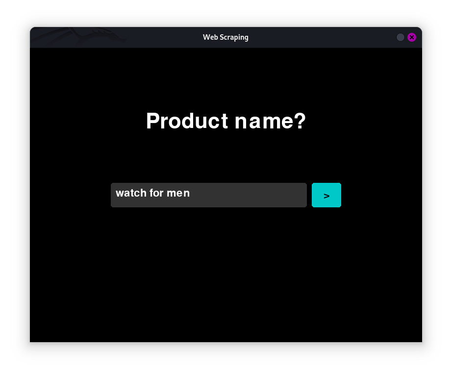
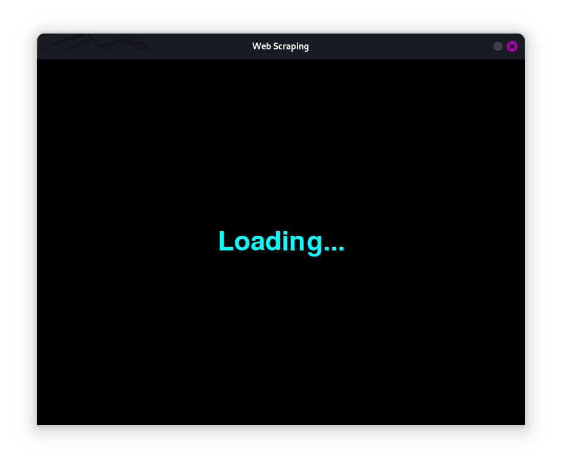
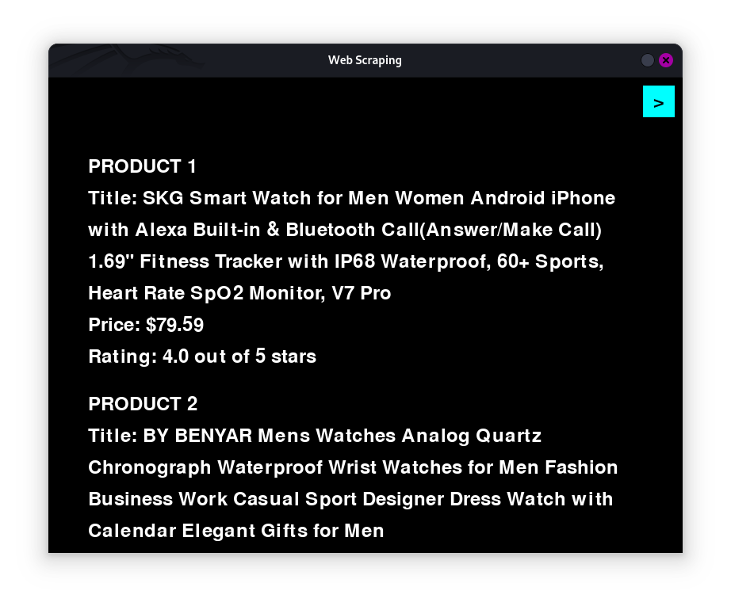

# PRODIGY_SD_05  
Software Development Internship of InfoTech Prodigy  

---

## Web Scraping 

A modular and interactive web scraping project built with Python and Pygame. This project combines dynamic UI transitions with a robust web scraping functionality to deliver an engaging and user-friendly experience.

### Keyword Input Screen  
  

### Loading Screen  
  

### CSV Generation Screen  
  

---

## Features ✨  

- **Interactive Screens**:
  - **Keyword Input Screen**: Allows users to input a URL or keyword to initiate scraping.
  - **Loading Screen**: Displays an animated "Loading..." message during the scraping process.
  - **CSV Generation Screen**: Displays the scraped product data, complete with scrolling functionality.

- **Cyan Close Button**:
  - A convenient close button (top-right corner) for quick program termination, with hover effects for better user interaction.

- **Mouse Scrolling**:
  - Smooth scrolling feature to navigate through scraped product listings.

- **Dynamic Scraping**:
  - Retrieves product titles, prices, and ratings from the web and saves the data in a CSV file for easy access.

- **Modular Design**:
  - Each screen and functionality is implemented as a separate module (`user_keyword.py`, `scrape.py`, `main.py`) for better maintainability.

---

## How to Use 

1. **Start the Program**:  
   - Run the `main.py` file to launch the program.

2. **Input Keyword or URL**:  
   - Enter a URL or keyword on the **Keyword Input Screen** and press Enter.

3. **Wait for Scraping**:  
   - View the **Loading Screen** while the scraping process completes.

4. **View Results**:  
   - Navigate the **CSV Generation Screen** to see the scraped product data.
   - Use the mouse scroll to browse through the data.  

5. **Close the Program**:  
   - Click the cyan `>` button in the top-right corner to exit.

---

## Installation 🛠️  

1. **Clone the Repository**:  
   ```bash  
   git clone https://github.com/shamiroxs/PRODIGY_SD_05.git  
   cd PRODIGY_SD_05  
   ```  

2. **Install Dependencies**:  
   Ensure Python 3, Pygame, and BeautifulSoup are installed.  
   ```bash  
   pip install pygame beautifulsoup4 requests  
   ```  

3. **Run the Program**:  
   ```bash  
   python main.py  
   ```  

---

## Project Structure 

```  
web-scraping/  
│  
├── main.py               # Controls screen transitions and program flow  
├── user_keyword.py       # Keyword Input Screen module  
├── scrape.py             # Web scraping and results display module  
├── url.txt               # Stores the input URL or keyword  
├── information.txt       # CSV file with scraped data  
├── /image                # Contains screenshots of screens  
│   ├── keyword.png       # Screenshot of Keyword Input Screen  
│   ├── loading.png       # Screenshot of Loading Screen  
│   └── csv.png           # Screenshot of CSV Generation Screen  
└── README.md             # Project Documentation  
```  

---

## Knowledge Gained 

This project helped me enhance my understanding of:  
- **Web Scraping**: Leveraging BeautifulSoup to extract web data efficiently.  
- **UI Design with Pygame**: Implementing interactive screens and dynamic scrolling.  
- **Modular Programming**: Structuring code for scalability and maintainability.  
- **File Management**: Writing scraped data into organized CSV files.  

---

## License 

This project is licensed under the MIT License. Feel free to use, modify, and share!  
